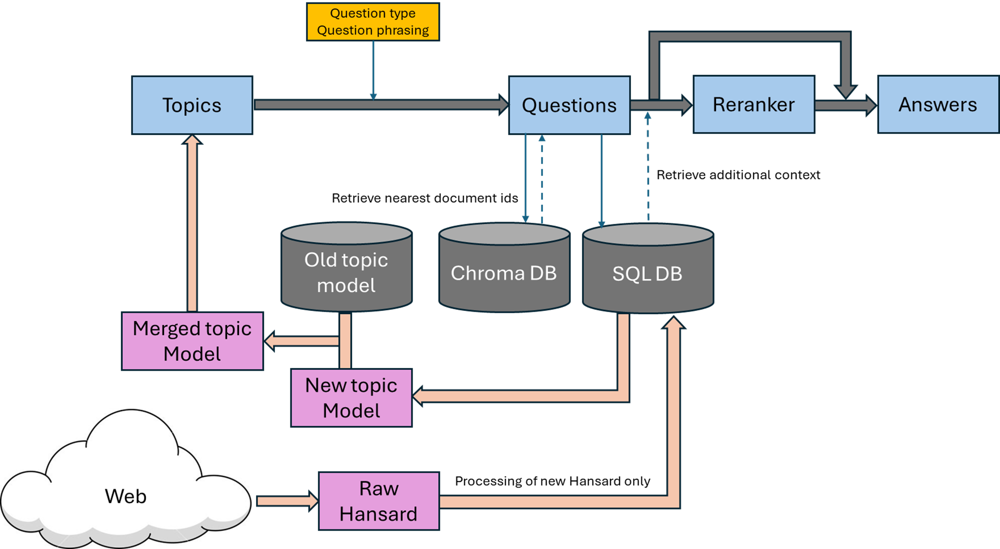

# AXIOM

A pipeline to generate policy aligned synthetic data

Three main questions:
1. How can data generated be aligned to Singapore context
2. How to ensure variety in the dataset
3. How to update the dataset given new policies

## Aligning synthetic data to the Singaporean context

One of the best available sources of Singapore policies and regulations come from the paliamentary debates (Hansard) in Singapore. Retrieval Augmented Generation is used
to extract useful information from Hansard and into the data generation.

AXIOM uses a simple RAG implementation where the paliamentary debates are broken down into individual speakers and their speeches. These represent the chunks or documents 
that are embedded and stored in the vector database. Retrieval is done simply by embedding the query and finding the closest few speeches in terms of cosine similarity.

More details on the RAG implementation are in the table below:

|   |   |
|---|---|
| Vector database      | ChromaDB                 |
| Embedder             | Qwen3-8b embedding model |
| Embedding dimension  | 4096                     |
| Chunking strategy    | Hansard speeches         |

## Ensuring variety in the dataset

Variety of question answer pairs in the dataset is also a tricky problem. AXIOM uses a clustering framework Bertopic to cluster the Hansard speeches into topics. Questions
are then generated from these topics.

This way of generating questions has a few advantages:
- Questions will belong to topics that are relevant to the retrieved documents.
- Adding more documents or changing what documents are in the vector database is not a problem.
- Topics generated will be more "natural" in the sense that it comes from real data.

More information on how Bertopic works to cluster topics can be found [here](https://maartengr.github.io/BERTopic/index.html)

Besides the topic generation, some crude usage of prompt engineering is also used to further diversify the questions for the dataset. Questions in AXIOM are generated based on
a supplied question type as well as a question phrasing.

## Updating the dataset given new policies

The dataset needs to be updated on the latest data, however regenerating the entirety of the dataset is inefficient.

AXIOM leverages on Bertopic's topic model merging functionalities to achieve efficient updates on the dataset. By creating a new topic model on the new data, and merging with the
old model fitted on the old data, Bertopic allows us to identify which topics have an increase in document count, and which topics are new. These topics, which ideally form a small
percentage of the total topics, are then passed through the pipeline to generate new question answer pairs for those topics.

## Full Pipeline architecture
