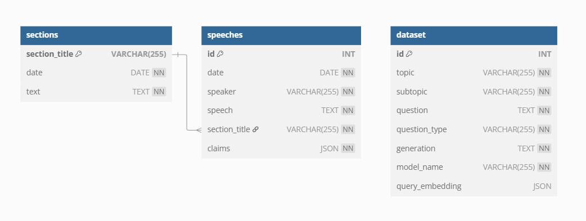
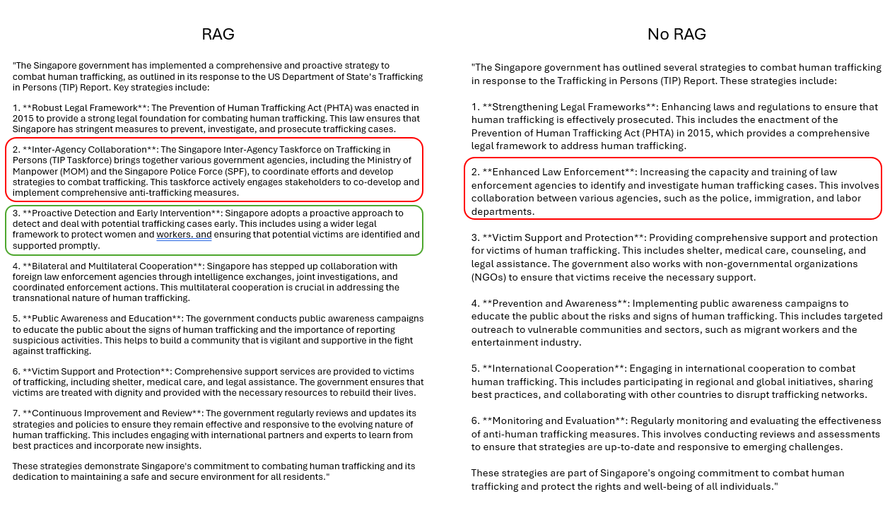

# Introduction - AXIOM
AXIOM is an automated pipeline for generation of synthetic SFT data on Singapore policies.

## Rationale
Policies change and models should reflect the latest updates in policy changes. Thus, AXIOM automates this process of updating a model's political alignment, by automating the generation
and updating of a political alignment SFT dataset.

## Methodology
This section outlines the thought process in creating AXIOM

The whole process of automating the generation of a dataset can be roughly broken down into 3 stages:
1. Extraction of new policies from the web
2. Creating a database that can handle updates of new policies that were extracted
3. Generation of the SFT dataset from the database.

## Meeting Notes and thought process

### 📅 (06/06/2025)
Methodology to extract policies from web:
1. Extract raw hansard from web
2. Clean raw hansard into text
3. Pass the text into LLM to generate json below

We chose Hansard as the source of policy information from the web. Hansard provides publicly available comprehensive transcripts of paliamentary debates in Singapore.

The information deemed relevant from paliamentary debates are the policies discussed, the final decision made for each policy, and the claims supporting the final decision as well as the claims against the final decision. In short, the information extracted can be visualized as many json objects, each one with the format below:

```json
  {
    "policy": "[the policy discussed in the debate]",
    "paliamentary debate": "[containing the details of which debate the policy was discussed in]",
    "final decision": "[the final decision of the policy discussed]",
    "claims for": [
      "claim 1 supporting the final decision",
      "claim 2 supporting the final decision",
      "..."
    ],
    "claims against": [
      "claim 1 against the final decision",
      "claim 2 against the final decision",
      "..."
    ],
  }
```

As multiple policies may be discussed in a paliamentary debate, a LLM is first tasked to extract the policies discussed in the debate. For each policy extracted, another LLM is tasked to extract
the final decision, the claims for and against as well as the ministries involved.

### 📅 (09/06/2025)
A few issues surfaced, below describes the issues and the proposed workarounds

### 1. Hansard paliamentary debates do not fit into the context length of Sagemaker hosted models.
A few chunking strategies were proposed, and 2 are to be tried together.
- Chunking by topic: within each sitting, there are clear separations between different topics discussed
- Chunking by speaker: extract the relevant content of each speaker through regex

Chunking by speaker presents the problem of not being able to extract the final decision of the policy discussed. Currently am unsure if the final decision is neccessary information for generating the SFT data.

### 2. Schema modifications
After taking a look at the generation of claims, final decision and policy, it seemed that the claims also contained policy information and could be used to generate the final SFT data instead. Some paliamentary debates were also clarifying and not an actual debate about a policy. Hence, some modifications to the schema were suggested:

#### Including the speaker into each json object
This allows us to determine the credibility of claims. For simplicity's sake, it was decided that anything said by the current ruling party is the truth.

#### Merging of claims for and against:
Not much point in separating the claims for and against if whether the deciding factor whether each claim is to be used is if the speaker making the claim is in the current ruling party or not.

new json format:
```json
  {
    "section_title": "[basically the policy discussed in the debate]",
    "file": "[contains the date of the debate]",
    "speaker": "[speaker of the claims below]",
    "claims": [
      "claim 1",
      "claim 2",
      "..."
    ],
  }
```

Arka also showed the new Qwen3 embedding model [link](https://qwenlm.github.io/blog/qwen3-embedding/) we could use in the future to validate our data

### Modified policy extraction methodology:<br>
1. Extract raw hansard from web
2. From raw hansard get sections through the html json schema
3. Extract speaker and speeches through regex
4. Generate claims using LLM

### 📅 (11/06/2025)
Identified some starting patterns for a speaker, using Ms Rahayu Mahzam as an example:
- The Minister of State for Health (Ms Rahayu Mahzam) (for the Minister for Health)\n:
- Ms Rahayu Mahzam\n: 
- (Ms Rahayu Mahzam)\n:

Speech ends with another person speaking or due to end of string

Thus, 2 main regex patterns were used to extract speeches:
```python
  rf"{mp}\n:.*?\n[^\d]*?\n:"
```

```python
  rf"\({mp}\)[^\d]*?\n:.*?\n[^\d]*?\n:"
```

{mp} denotes a placeholder for a mp name

Speech ending due to end of string is checked if the 2 above regex patterns do not return matches. Slightly modified version of the regex above are used, without the "?\n[^\d]*?\n:" at the end
of each regex pattern.

### 📅 (12/06/2025)
Sucessfully extracted speeches from individual speakers and then used Qwen2-5-72B-Instruct-2025-05-28-10-43-09 to generate the claims made by each speaker in their speech.

**📄 [Link](https://github.com/ItsTYtan/Policy_RLHF/blob/main/docs/jsonOutputs/policyextraction.json) to json**

Some speeches do not contain useful information, and the claims array is made to be empty
```json 
{
  "file": "2025-04-08.json",
  "section_title": "Increase in Water Seepage Issues in HDB Flats and Adequacy of 
  Staff Assigned to Rectify These Issues",
  "speaker": "Ms Sim Ann",
  "speech": "(Ms Sim Ann) (for the Minister for National Development)\n: Mr Speaker, 
  Sir, may I have your permission to give a combined reply to Question Nos 3 through 
  6 in today’s Order Paper?\nMr Speaker\n:",
  "claims": []
}
```

However, some speeches contain useful info, but claims array is still empty
```json
{
  "file": "2025-04-08.json",
  "section_title": "Target Date to Revise Penalties for Animal Cruelty and 
  Introduce Failure in Duty of Care Provisions",
  "speaker": "Mr Tan Kiat How",
  "speech": "Mr Tan Kiat How\n: Sir, on the two questions that Mr Chua has raised, 
  let me take them in turn.\nOn the first one around how we ensure compliance with 
  the\nCode of Animal Welfare (for the Pet Industry), t\nhese are guidelines that 
  we put forward. And if there are members of the public, industry players or 
  operators who want to report any non-compliance, please let us know. NParks, as
  part of its broader licensing framework and regulatory ambit, will do spot checks
  and take a look at some of these places.\nOn the second point on the 
  disqualification order (DO), just to confirm with Mr Chua that he was asking about
  DO? No? I could not hear the question.\nMr Chua Kheng Wee Louis\n:",
  "claims": []
}
```

Suspect is due to API limits on rate of incoming requests.

(13/06/25)
- Narrow down issue on generation
- Check out qwen 3 embedding
- Research on how to bake in policy question into sft data making it more conversational instead of stance
- Research on db

(16/06/25)
Research on next 2 steps of AXIOM
### SFT generation ideas
Goal is to let the model generalize the training data, able to subtly inject policies and rationale wherever relevant.
Can either improve the dataset or improve the way the model is fine tuned.

Few ways to go about generating data:
- Simply pair up the questions and answers from hansard debate. Will risk sounding like MP, need a way to mix with other training data.
- Generate questions from the claims. However the claims itself may not have sufficent information to generate a singapore policy aligned question. How to generate questions from the claim is also rather subjective.
- Improve the previous policy dataset using RAG on hansard policies. Potential downsides include non comprehensive coverage of all policies in hansard.

Explored some methods to allow the model to generalize better:
Paper on mitigating memorization [Link](https://arxiv.org/html/2410.02159v2)

Should maybe start with the naive way first. To generate data that is informational first and then see if the fine tuning techniques help to mitigate memorization. Think its going to be very hard to come up with subtle quesitons on policy, and a synthetic dataset that does not have any underlying patterns.

### Evaluation of SFT dataset
Lack of domain specific singapore policy datasets. One way I can think of is to use LLM as a judge on a
non finetuned vs a finetuned model on our dataset. The LLM as a judge may have to be supplemented with RAGed knowledge from hansard debates, since it may not rate generations that are aligned with singapore policies higher.

Another problem might be getting the test dataset. If we get the question from the claims, then splitting the dataset into test and train might test the model on political claims it has not seen before. Might need to craft some subtle questions ourselves.

Normal ablation testing can also be carried out to ensure model does not perform worse on other tasks.

### Policy clustering and database
[Temporary chatgpt deep-research link](https://chatgpt.com/share/6850d897-c964-8013-b0d0-da1a97956cd5)
[Research on clustering](https://www.mdpi.com/1999-4893/18/5/289)

Use qwen3 embedding or sbert to generate embeddings, group them into clusters using Kmeans or some other algo.

### RAG using Qwen3 embedding and reranking model
Embedding to find top k similar documents. Reranking to find the best fit document (in terms of fitting the instruction).

RAG can be used to:
- generate accurate citations for the SFT dataset
- cluster the policies into few main topics for step 2

(18/06/25)
Decide to focus on the RAG method to build on the previous dataset generated.

Generated embeddings for speech, section title and queries. Set up basic RAG pipeline with qwen3 embedding and reranker models

Foresee the need of an actual database. The data and embeddings are stored sparesly in json files all over. The actual database may not only simplify workflows, but also enable the use of more complex and custom RAG strategies. 

SQLite seems like a good option, since it is easy to setup. Dont need concurrency and production grade features of dbs like psql.

(19/06/25)
Data is getting too messy, decided to transfer all data into sql database for sanity.

Current db architecture:


To recap, rationale for sql database:
- Simplify workflows, no more jsonl files all over the place
- Enable the use of more complex and custom RAG strategies
- Long term, when new debate transcripts come in, dont want to update the whole dataset, but only add in/remove whats neccessary

(23/06/25)
Speeches can be way too long which is both problematic when reranking as well as doing in context rag generation for the dataset later.

Decide to do the naive simplest approach first. First only use the embeddings to generate the most similar speech, and then do in context rag. No reranking is done here

This will be followed by another approach which reranks by claims instead of speeches. Use the speech embeddings to extract the most similar speeches, then accumulating all the claims of all the speeches, and then reranking from there.

Nick also suggested summarizing the speeches to improve embedding retrieval.

Splitting strategy --> document hierachy
Embedding strategy --> 


(24/06/25)
tried claim based reranking, still very slow and inaccurate with the 0.6b model.

(25/06/25)
Doing some research on how to improve the RAG
[deepreasearch](https://chatgpt.com/share/685df440-6614-8013-8983-5afe0638cc88)
[Advanced RAG techniques](https://medium.com/@roberto.g.infante/advanced-rag-techniques-with-langchain-f9c82290b0d1)

Coarse chunking improves context but reduces detail --> chunking by speech
Granular chunking improves detail but reduces context --> chunking by claims

Some ideas:
- Reduce chunk size of speeches by asking a llm to summarize the speech and remove filler dialogue that happens in paliarment.
- Multi Vector Retriever strategy, embed the claims as additional embeddings for the speech document.
- Hypothetical Document Embeddings (HyDE)
- Query rewriting/Generating multiple queries/Step back question

Advanced techniques:
- Self querying
- Sql query generation

Recap of the current issues with rag:
Tried searching by speeches naively, however, the context can be too large.
To reduce context size, tried another method of searching by speech embeddings, and then reranking the claims of the speech. However, the claims are mostly not relevant.
Think the most logical next step is to reduce the chunk size of the speeches by summarizing and removing noise, that way it tackles all problems, and is also a stepping stone for future rag implementations.

(01/07/25)
Summarized speeches and sections, ran rag and genertation on them. Here is one example result

Query: "Cn the S'pore govt provide details on their stratgies 2 combat human traficking as outlined in their respnse 2 the TIP rpt?"

